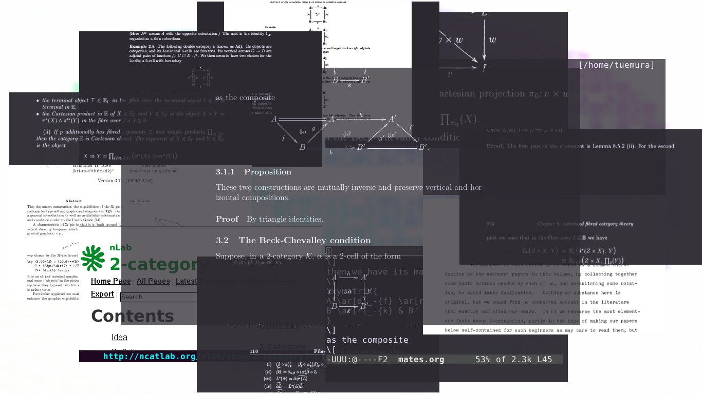
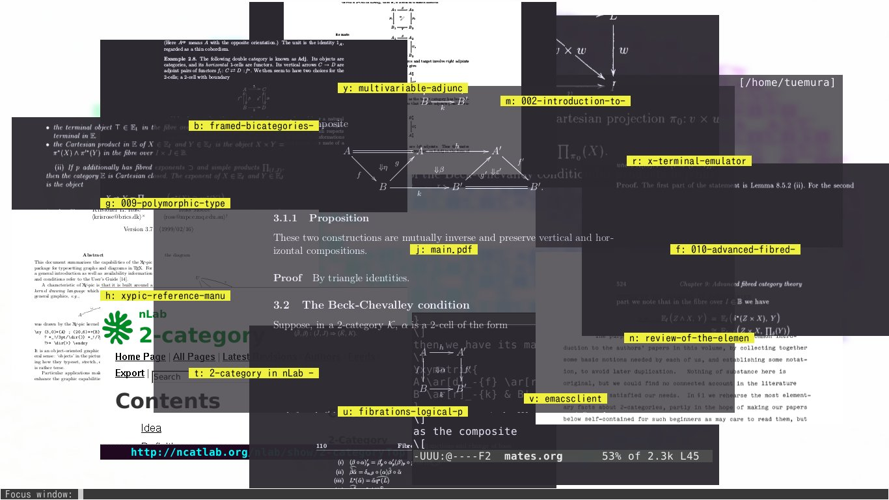
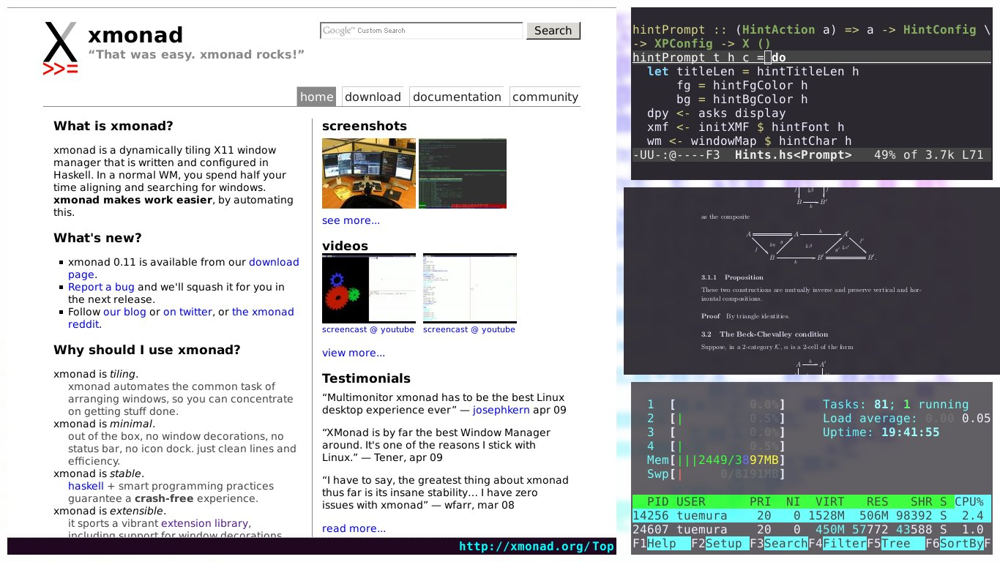

.xmonad
=======

Configurations for [xmonad](http://xmonad.org).

Requirements
------------

* `xscreensaver`
:   to lock screen
* `unclutter`
:   to make mouse cursor invisible
* `xcompmgr` and `transset`
:   to make windows transparent
* `feh`
:   to set background image
* `imagemagick`
:   to take a screenshot

Install
-------

```
$ git clone https://github.com/uemurax/dot-xmonad ~/.xmonad
$ xmonad --recompile
```

Features
--------

### Hit a Hint ###

We can use *hints*,
inspired by [Vimperator](http://www.vimperator.org/),
to do something on a window.

Here's the list of operations.

| Key | Operation |
| --- | --------- |
| `M-f`, `M-; f` | Focus the selected window |
| `M-; m` | Bring the selected window to master area |
| `M-; s` | Swap the selected window and the currently focused window |
| `M-; c` | Close the selected window |
| `M-; t` | Sink the selected window |
| `M-; S-t` | Float the selected window |
| `M-; S-m` | Float and maximize the selected window |

Screenshots
-----------

### Circle + Transparent ###



### Hints ###



### Spacing ###


